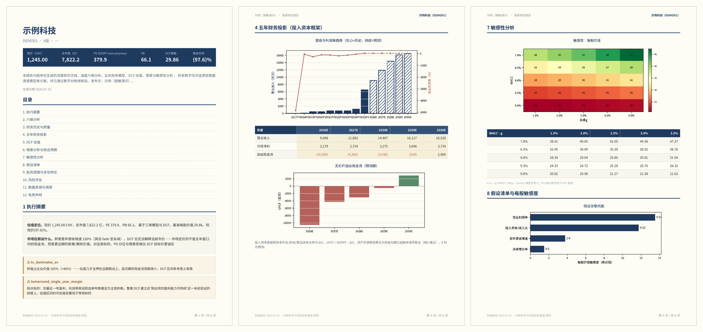

# equity-research-suite · 个股研究助手

> 一个能自动写股票研究报告的工具。你说一个股票，它给你出一份**每个数字都能查到出处**的分析报告——快速看板、投资速览（3-5 页 PDF）、或深度研报（长文 PDF）。

<p align="center">
  
  <br>
  <em>↑ 深度研报效果（示例已脱敏，公司名为虚构）：封面 · 五年财务模型与图表 · 敏感性热力图</em>
</p>

---

## 🚀 本次超进化：从"看指标"到"出研报"

> [!IMPORTANT]
> 老版本 `stock-metrics-pro` 是一个**单层脚本**——查行情、算比率、看技术面，输出一段文字。
> 新版 `equity-research-suite` 把它**重构成一套三层研报流水线**，能真正出一份**机构级、每个数字可对账**的深度研报。这不是修修补补，是一次结构性升级。

| 维度 | 老版（stock-metrics-pro） | ✨ 新版（equity-research-suite） |
|---|---|---|
| **架构** | 单层脚本 | **三层解耦**：数据引擎 → 分析建模 → 出版排版，两道 JSON 契约串联 |
| **防编造** | 无 | **三道自动闸**——结构闸 + 模型自洽闸 + **全文数字对账闸**（报告里每个数字都必须溯源，否则拦下不交付） |
| **估值** | 比率 + 技术面 | **完整三表财务模型 + DCF**（期中折现、投入资本框架、股权桥、少数股东处理）+ **情景/敏感性/隐含预期还原** |
| **可比** | 无 | **可比公司框架**（同业圈定 + 口径调整） |
| **医药** | 基础 | **rNPV 管线估值 + 专利悬崖 + 临床催化剂** |
| **输出** | 一段文字 | **三档产物**：快速看板 / 3-5 页速览 PDF / **长文深度研报 PDF** |
| **补充研究** | 无 | **联网研究独立分区**：行业/竞争/近期动态，与量化部分分开、**逐句标引用来源** |
| **排版** | 无 | 出版层重写（WeasyPrint + matplotlib 矢量图 + 全页配色 + 自动抓公司 logo） |
| **数据源** | 免费源 | 免费源开箱即用 + **付费终端声明式适配器**（iFinD / Wind / Tushare / Bloomberg 可选接入） |
| **语言** | 中文 | **中英双语** |
| **质量保障** | 手动 | **186 项单元测试 + 8/8 端到端回归**，退出码驱动自迭代 |

**一句话**：老版帮你**快速判断一只股票贵不贵**；新版帮你**从头做研究、出一份数字全部可查的研报**——而且它自己会拦住任何编造的数字。

---

## 这是什么

一句话：**给它一个股票代码，它帮你做研究、出报告。**

覆盖 **A股 / 港股 / 美股**。它不是让 AI 随口说说，而是：

- 📊 **所有数字都是脚本算的**——估值、财务比率、DCF 每股价值、增长率，全部由 Python 计算，不是 AI 编的
- 🔍 **每个数字都能查出处**——报告里出现的每个数字，都能追溯到数据源或模型；查不到的会被工具自己拦下来，不让它进报告
- 🧬 **医药股专项**——自动做管线估值（rNPV）、专利悬崖、临床催化剂分析
- 💬 **中英双语**

它**不给买卖建议**，只做数据分析和呈现。

---

## 三种输出

| 你说 | 它给你 |
|---|---|
| "茅台现在贵不贵" | **快速看板**——估值、赚钱质量、技术面（几分钟） |
| "给我一份宁德时代的投资速览" | **3-5 页 PDF**——估值对比、催化剂、情景分析 |
| "做一份恒瑞的深度研报" | **长文 PDF**——三表财务模型、DCF 估值、可比公司、情景与敏感性、（医药）管线 rNPV |

深度研报还能接一段**联网研究的补充分析**（行业趋势、竞争格局、近期动态），和前面严谨的量化部分分开呈现、每句话标出处。

---

## ⚠️ 只能在「桌面版 AI」里用，不支持网页版

本工具是一个 **Skill（技能，SKILL.md 格式）**，凡是**支持 Skills 的 AI 桌面客户端都能用**，不绑定某一家。例如：

- **Claude 桌面版**（Cowork 模式）
- **Kimi 桌面版**（Kimi 精选 Skills 就是这个格式）
- **Qwen Code / 通义**、**MiniMax（Mini-Agent）** 等支持 SKILL.md 技能的桌面客户端

**为什么不支持网页版**：它要在你电脑上装 Python 库、跑脚本、联网抓行情数据——这些只有桌面客户端能做，网页版做不到。

---

## 快速开始（小白版）

### 1. 装工具

在你的**桌面版 AI** 里导入这个技能。以 **Claude 桌面版**为例：**设置 → Custom Skills → 上传** `equity-research-suite.skill`。

其他客户端（Kimi 桌面版、Qwen、MiniMax 等）大同小异——找到「技能 / Skills / 导入」入口，上传 `.skill` 文件，或直接克隆本仓库、把整个文件夹放进该客户端的技能目录即可。

### 2. 装依赖

第一次用会提示装依赖。打开电脑的命令行，进到项目文件夹，运行：

```bash
pip install -r requirements.txt
```

免费数据源**开箱即用，不需要任何账号或密码**。

### 3. 开始用

在你的桌面版 AI 里直接说：

> 帮我分析一下贵州茅台

工具会问你要哪种深度（快速看板 / 速览 / 深度研报），然后开工。

---

## 想要更准的数据？（可选）

免费数据源够用了，但如果你有付费终端的账号（同花顺 iFinD、Wind、Tushare Pro、Bloomberg 等），可以接上去，解锁更完整的季度财报、一致预期、分部数据。

- 有 API token 的：设一个环境变量就行
- 有导出的财报 Excel 的：直接把文件发给工具

详细步骤见 [`数据源接入说明.md`](数据源接入说明.md)。

---

## 它靠什么保证"不编数字"

这是本工具和普通 AI 分析最大的区别——**三道自动检查闸**：

1. **结构闸**：数据取回来后，检查格式是否合规，不合规当场拦下
2. **模型闸**：财务模型必须自洽——资产负债表要平、现金流要勾稽、概率和要等于 1，否则不让出报告
3. **对账闸**：出报告前，扫描报告里**每一个数字**，在数据源和模型里找不到的，一律拦下、不许交付

换句话说：**报告里出现的每个数字，工具都替你核对过出处。** 联网研究的部分则要求每句带数字的话都标引用来源。

---

## 自测

```bash
python selfcheck/run_regression.py
```

跑 180+ 项单元测试 + 端到端冒烟 + 三道闸校验。

---

## 边界与免责

这是一个**研究辅助工具**，所有输出**仅为数据分析与呈现，不构成任何投资建议**。

- 模型输出（DCF 每股价值、情景目标价、医药 rNPV）是**基于假设的情景估算，不是价格预测**
- 标了"需人工核对"的主观假设，请自己核对
- 医药 rNPV 尤其是**数量级示意，不是目标价**
- 投资有风险，决策请独立判断、自担后果

不接任何交易接口，不做下单。

---

## 归属

本工具在若干前作基础上构建，来源与许可证见 [`THIRD-PARTY-NOTICES.md`](THIRD-PARTY-NOTICES.md)。核心引擎为作者自研（MIT）；分析框架与出版层的**方法思路**借鉴了公开的研报工具，具体代码与文档均为原创重写。

报告中若显示公司 logo，归各自商标权利人所有，仅作标识性引用。

---

## 许可

[MIT](LICENSE)（自研部分）。第三方组件的许可见 THIRD-PARTY-NOTICES.md。
